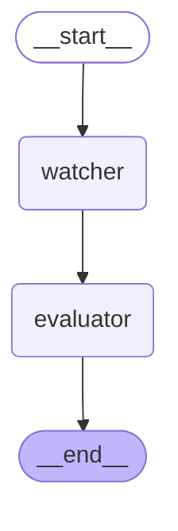
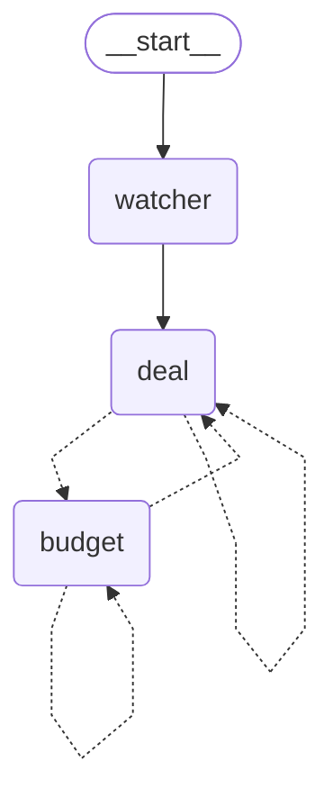
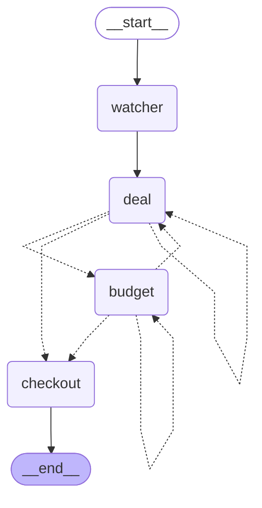
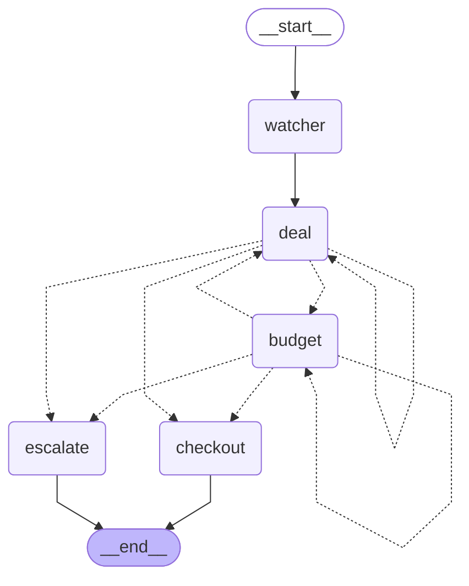

# Graphs for each step

Generated by `python tools/draw_graphs.py`.

## Self-starting agents

```mermaid
---
config:
  flowchart:
    curve: linear
---
graph TD;
	__start__([<p>__start__</p>]):::first
	watcher(watcher)
	evaluator(evaluator)
	__end__([<p>__end__</p>]):::last
	__start__ --> watcher;
	watcher --> evaluator;
	evaluator --> __end__;
	classDef default fill:#f2f0ff,line-height:1.2
	classDef first fill-opacity:0
	classDef last fill:#bfb6fc
```

## Two agents, no rules

```mermaid
---
config:
  flowchart:
    curve: linear
---
graph TD;
	__start__([<p>__start__</p>]):::first
	watcher(watcher)
	deal(deal)
	budget(budget)
	__start__ --> watcher;
	budget -.-> deal;
	deal -.-> budget;
	watcher --> deal;
	budget -.-> budget;
	deal -.-> deal;
	classDef default fill:#f2f0ff,line-height:1.2
	classDef first fill-opacity:0
	classDef last fill:#bfb6fc
```

## Fix 1 · One owner per task

```mermaid
---
config:
  flowchart:
    curve: linear
---
graph TD;
	__start__([<p>__start__</p>]):::first
	watcher(watcher)
	deal(deal)
	budget(budget)
	checkout(checkout)
	__end__([<p>__end__</p>]):::last
	__start__ --> watcher;
	budget -.-> checkout;
	budget -.-> deal;
	deal -.-> budget;
	deal -.-> checkout;
	watcher --> deal;
	checkout --> __end__;
	budget -.-> budget;
	deal -.-> deal;
	classDef default fill:#f2f0ff,line-height:1.2
	classDef first fill-opacity:0
	classDef last fill:#bfb6fc
```

## Fix 2 · Budget and stop

```mermaid
---
config:
  flowchart:
    curve: linear
---
graph TD;
	__start__([<p>__start__</p>]):::first
	watcher(watcher)
	deal(deal)
	budget(budget)
	checkout(checkout)
	escalate(escalate)
	__end__([<p>__end__</p>]):::last
	__start__ --> watcher;
	budget -.-> checkout;
	budget -.-> deal;
	budget -.-> escalate;
	deal -.-> budget;
	deal -.-> checkout;
	deal -.-> escalate;
	watcher --> deal;
	checkout --> __end__;
	escalate --> __end__;
	budget -.-> budget;
	deal -.-> deal;
	classDef default fill:#f2f0ff,line-height:1.2
	classDef first fill-opacity:0
	classDef last fill:#bfb6fc
```
